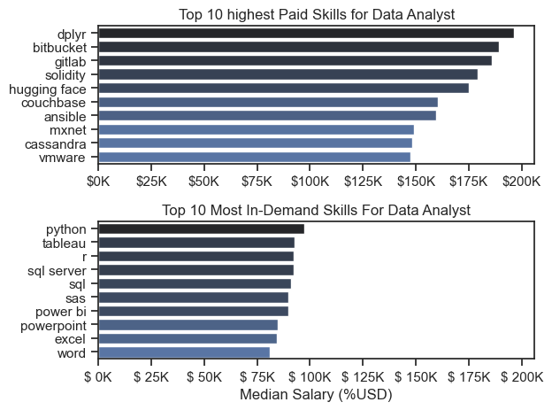

## How are in-demand skills trending for Data Analyst?

```python

from matplotlib.ticker import PercentFormatter
df_plot= df_da_us_percent.iloc[:, :5]
sns.lineplot(data=df_plot, dashes=False, palette='tab10')
plt.gca().yaxis.set_major_formatter(PercentFormatter(decimals=0))

plt.show()

```

## Result

*Bar graph visualizing the trending top skills for data analyst in the US in 2023.*

## How well do jobs and skills pay for Data Analysts?

```python

sns.boxplot(data=df_us_top6, x='salary_year_avg', y='job_title_short', order=job_order)
ax= plt.gca()
ax.xaxis.set_major_formatter(plt.FuncFormatter(lambda x, pos: f'${x/1000:1.0f}K'))
plt.show()

```

#### Result


## Highest Top 10 Skills for Data Analyst


```python

fig,ax= plt.subplots(2,1)
# Top 10 Highest Paid Skills For Data Analysts

sns.barplot(data=df_da_top_pay, x='median', y=df_da_top_pay.index, ax=ax[0], hue='median', palette='dark:b_r')

# Top 10 In-Demand Skills for Data Analyst
sns.barplot(data=df_da_skills, x='median', y=df_da_skills.index, ax=ax[1], hue='median', palette='dark:b_r')
plt.show()

```


